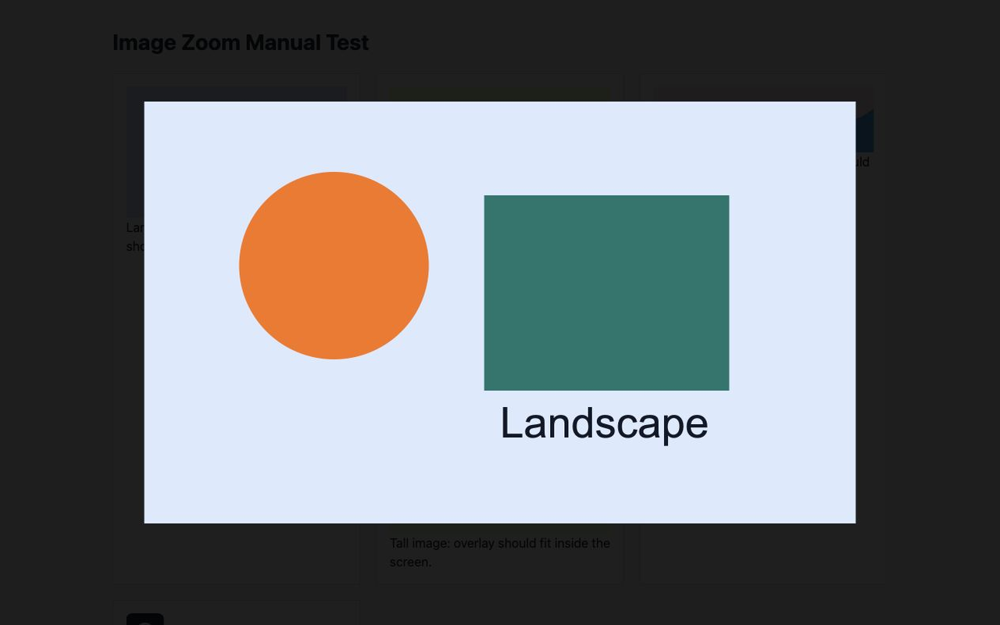

# Image Zoom

Image Zoom is a small Chrome extension for zooming images on web pages.

It has no popup, no account, no analytics, no storage, and no server. It runs as a simple Manifest V3 content script on normal `http://` and `https://` pages.



## What It Does

- Hover over a useful image to show the zoom cursor.
- Click an image to open the full-page zoom overlay.
- After an image has been clicked once, scroll over that same image to zoom it inline.
- In the overlay, scroll to zoom and drag to pan.
- Press Escape or click the dark background to close the overlay.
- Ignore tiny images under 80px wide or 80px tall.

When an image has a larger `srcset` option, the overlay uses that larger image on demand.

## Install For Local Testing

1. Open `chrome://extensions`.
2. Turn on Developer mode.
3. Click Load unpacked.
4. Choose this project folder.

The extension does not run on `chrome://` pages, Chrome Web Store pages, extension pages, or local file URLs.

## Local Test Page

Open `tests/manual.html` in a browser. The test page loads the same script and styles directly, so it can be tested before loading the extension.

You can also serve the folder locally:

```sh
python3 -m http.server 8765
```

Then open:

```text
http://127.0.0.1:8765/tests/manual.html
```

## Chrome Web Store Package

Run:

```sh
scripts/package-extension.sh
```

This creates:

```text
dist/image-zoom-v0.1.0.zip
```

The ZIP contains only the extension runtime files:

- `manifest.json`
- `content.js`
- `styles.css`
- `icons/`

Use `CHROMEWEBSTORE.md` for store listing copy, permission notes, privacy disclosure, and submission steps.

Project page:

```text
https://liewcf.github.io/imagezoom/
```

Privacy policy:

```text
https://liewcf.github.io/imagezoom/privacy/
```

Store assets are in `store-assets/`.

## Privacy

Image Zoom does not collect, store, sell, or share user data.

It reads image elements on the current page only so it can zoom them. If a page provides a larger image through `srcset`, the browser may load that existing image URL for the overlay. The website hosting the image may receive the normal image request. No data is sent to the extension developer.

## Development Checks

Run these before saying behavior is fixed:

```sh
node --check content.js
node --test tests/content.test.js
node --test tests/manifest.test.js
node --test tests/public-surface.test.js
python3 -m json.tool manifest.json
sh -n scripts/package-extension.sh
scripts/package-extension.sh
unzip -t dist/image-zoom-v0.1.0.zip
```

## Current Status

Version `0.1.0` is prepared for Chrome Web Store submission.

Before submitting, regenerate the ZIP after source changes, load the extension through `chrome://extensions`, test it on one real image-heavy website, and fill in the owner publisher/contact fields in the Chrome Developer Dashboard.
